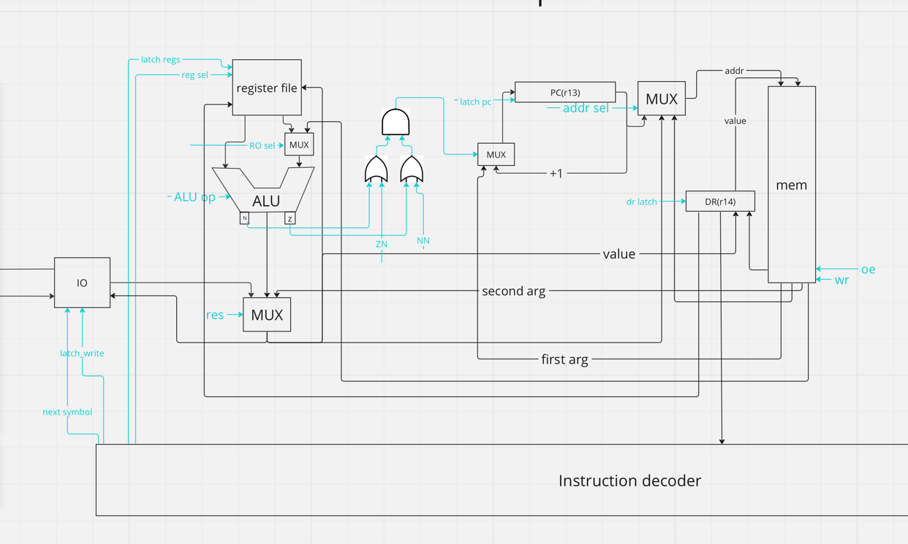

# CSA lab 3

- `alg | risc | neum | hw | tick | struct | stream | port | pstr | prob2 | pipeline`


## Язык программирования
Разработанный язык похож является некой упрощенной версией javascript. Строки разделяются точкой с запятой. Язык 
поддерживает объявление и инициализацию переменных, математические операции, конструкции if, if-else, while, операции read() - читает строку из входного буфера
и print_str(), print_int(). Язык не поддерживает функции. Есть только 2 типа - int, str. Типизация сильная, динамическая.
Язык поддерживает области видимости, которые определяются блоками while и if.
``` ebnf
program ::= statement | program statement
statement ::= conditional | while | io | allocation | assign | if
assign ::= name "=" expr
io ::= read | print_int | print_str
conditional ::= if | else
if ::= "if" "(" comp_expr ")" "{" program "}"
else ::= "else" "{" program "}"
while ::= "while" "(" comp_expr ")" "{" program "}"
read ::= "read(" value ")" semicolon
print_str ::= "print(" name ")" semicolon | "print(" string ")" semicolon
print_int ::= "print(" name ")" semicolon | "print(" number ")" semicolon
allocation ::= "let" name "=" value semicolon
value ::= string | number
string ::= "\"[\w\s,.:;!?()\\-]+\""
comp_expr ::= expr comparison_sign expr
expr ::= "(" expr ")" | expr op expr | number | string | name
comparison_sign ::= "==" | ">=" | ">" | "<" | "<=" | "!="
name ::= "[a-zA-Z]+"
number ::= "-?[0-9]+"
semicolon ::= ";"
op ::= "*" | "/" | "%" | "+" | "-" | "<<" | ">>" | "&" | "|" | "^"
```

Пример программы:
```
let f1 = 1;
let f2 = 2;
let ans = f2;
let max = 4000000;
while( f1 + f2 < max ) {
let f3 = f1 + f2;
if (f3 % 2 == 0) {
  ans = ans + f3;
}
f1 = f2;
f2 = f3;
}
print_int(ans);
```

Поддержка литералов -- поддерживаются строковые и числовые литералы.

## Организация памяти

Модель памяти процессора (приведено списком, так как тривиальна):
1. Память(общая). Машинное слово -- 32 бита, реализуется списком объектов класса WORD.
Данные лежат там же, но вместо их опкода поставлена заглушка,

Память программы начинается с машинных инструкций. За ней следует буфер, который выделен для строки из ввода.
Далее в статической памяти лежат строки в паскальном представлении. Числовые переменные и ссылки на строки лежат на стеке. 
Числовые литералы выделяются на стеке, строковые в статической памяти.

Так как до конца компиляции размер программы неизвестен, везде, где нужны адреса строк, ставятся заглушки, которые потом резолвятся
## Система команд

Особенности процессора:

- Машинное слово -- 32 бита, знаковое.
- Поток управления:
    - инкремент `PC` после каждой инструкции;
    - условные и безусловные переходы.
У команды может быть до двух аргументов.

### Набор инструкций
| Язык   | Инструкция | Кол-во тактов | операнды       | Пояснение                                          |
|:-------|:-----------|---------------|:---------------|:---------------------------------------------------|
|        | ST_ADDR    | 3             | 2 (reg, int)   | Прямая адресация                                   |
|        | ST         | 4             | 2 (reg, reg)   | Косвенная адресация - в левый по адресу из правого |
|        | ST_STACK   | 4             | 2 (reg, int)   | Относительно конца стека                           |
|        | LD_ADDR    | 4             | 2 (reg, int)   | Прямая адресация                                   |
|        | LD_LIT     | 3             | 2 (reg, int)   | Загрузка литерала                                  |
|        | LD         | 4             | 2 (reg, reg)   | Косвенная адресация                                |
|        | LD_STACK   | 4             | 2 (reg, int)   | Относительно конца стека                           |
|        | MV         | 4             | 2 (reg, reg)   |                                                    |
| read() | READ_CHAR  | 3             | 2 (reg, port)  |                                                    |
|        | PRINT_CHAR | 3             | 2 (reg, port)  |                                                    |
|        | JLE        | 3             | 1 (addr)       |                                                    |
|        | JL         | 3             | 1 (addr)       |                                                    |
|        | JGE        | 3             | 1 (addr)       |                                                    |
|        | JG         | 3             | 1 (addr)       |                                                    |
|        | JNE        | 3             | 1 (addr)       |                                                    |
|        | JE         | 3             | 1 (addr)       |                                                    |
|        | JUMP       | 3             | 1 (addr)       |                                                    |
| +      | ADD        | 3             | 2 (reg, reg)   |                                                    |
|        | ADD_LIT    | 3             | 2 (reg, val)   |                                                    |
|        | NEG        | 3             | 1 (reg)        |                                                    |
|        | SHL        | 3             | 2 (reg, reg)   |                                                    |
|        | SHR        | 3             | 2 (reg, reg)   |                                                    |
|        | AND        | 3             | 2 (reg, reg)   |                                                    |
|        | OR         | 3             | 2 (reg, reg)   |                                                    |
|        | XOR        | 3             | 2 (reg, reg)   |                                                    |
| -      | SUB        | 5             | 2 (reg, reg)   |                                                    |
|        | CMP        | 5             | 2 (reg1, reg2) |                                                    |
|        | PUSH       | 5             | 1 (reg)        |                                                    |
|        | POP        | 5             | 1 (reg)        |                                                    |
|        | INC        | 3             | 1 (reg)        |                                                    |
|        | DEC        | 3             | 1 (reg)        |                                                    |
|        | HALT       | 0             | 0              |                                                    |
Умножение и деление, функции вывода строки и числа реализованы на уровне транслятора путем вставки ассемблерного кода.

### Кодирование инструкций

- Машинный код сериализуется в список JSON.
- Один элемент списка -- одна инструкция.
- Индекс списка -- адрес инструкции. Используется для команд перехода.

Пример:

```json
[
    {"index": 209, "opcode": "JUMP", "arg1": 0, "arg2": 0}
]
```

где:

- `opcode` -- строка с кодом операции;
- `arg1`, `arg2` -- аргумент (могут отсутствовать);
- `index` -- адрес.

Типы данных в модуле [machine](./isa.py), где:

- `Opcode` -- перечисление кодов операций;

## Транслятор

Интерфейс командной строки: `translator.py <input_file> <target_file>`

Реализовано в модуле: [translator](./translator.py)

Этапы трансляции (функция `translate`):

1. Лексер - Трансформирование текста в последовательность значимых термов.
2. Парсер - перевод представления из первого этапа в АСТ.
3. Трансляция АСТ в машинный код.

Правила генерации машинного кода:

Каждая нода дерева АСТ переводится в соответсвтющее представление в ассемблерном коде. Для каждого типа ноды написан обработчик,
в котором эта нода транслируется в машинный код. Основная часть функционала языка - конструкции умножения и деления, вывода и ввода, 
циклы и ветвления - реализованы на уровне трансляции в машинный код.


## Модель процессора

Интерфейс командной строки: `machine.py <machine_code_file> <input_file>`

Реализовано в модуле: [machine](./emulator.py).

Было принято решение не разделять DataPath и ControlUnit на схеме из-за использования одной и той же памяти и там, и там, и неудобства
изображения схемы.


Модель процессора имеет 16 регистров:

r0 - hardwared 0

r1 - адрес начала стека, относительно этого значения берутся переменные

r2-r8 регистры общего назначения

r9, r10, r11, r12 - tmp, в r9, r10 основном используются для сохранения параметров

r13- program counter

r14 - DR - адрес записи в память

r15 - stack pointer


Ввод и вывод имеет порты

Сигналы и селекторы - oe, wr - чтение, запись из памяти

dr sel - выбор источника для записи в dr

RO sel - выбор источника правого операнда

ALU op - выбор операции алу

res - выбор источника для данных(из алу, памяти, или устройства ввода)

ZN - 1, если zero не необходим, 0 иначе

NN - 1, если neg не необходим, 0 иначе

latch_reg_NUM - защелкнуть регистр

reg sel - выбрать регистр из регистрового файла

latch_write - вывести в устройство

next_symbol - ввести с устройства


- Цикл симуляции осуществляется в функции `simulation`.
- Шаг моделирования соответствует одной инструкции с выводом состояния в журнал.
- Для журнала состояний процессора используется стандартный модуль `logging`.
- Количество инструкций для моделирования лимитировано.

## Тестирование

В качестве тестов использовано 6 алгоритмов:
1. [hello world](golden/hello_world.yml).
2. [cat](golden/cat.yml) -- программа `cat`, повторяем ввод на выводе.
3. [hello user](golden/hello_user.yml). - приветствие пользователя
4. [math](golden/math.yml). - тест корректности реализации математических выражений
5. [math](golden/prob5.yml). - prob5 из задания
6. [math](golden/prob5_optimized.yml). - оптимизированный prob5 без использования деления по модулю

Рассмотрим алгоритм Hello World. Исходный код выглядит следующим образом
```
  let hello = "Hello, world!";
  print_str(hello);
```
После компиляции
```
  [{"index": 0, "opcode": "LD_LIT", "arg1": "r3", "arg2": 0},
   {"index": 1, "opcode": "PUSH", "arg1": "r3", "arg2": 0},
   {"index": 2, "opcode": "LD_LIT", "arg1": "r4", "arg2": 49},
   {"index": 3, "opcode": "ST_STACK", "arg1": "r4", "arg2": 0},
   {"index": 4, "opcode": "LD_STACK", "arg1": "r9", "arg2": 0},
   {"index": 5, "opcode": "MV", "arg1": "r9", "arg2": "r11"},
   {"index": 6, "opcode": "INC", "arg1": "r11", "arg2": 0},
   {"index": 7, "opcode": "LD", "arg1": "r9", "arg2": "r9"},
   {"index": 8, "opcode": "LD_LIT", "arg1": "r10", "arg2": 0},
   {"index": 9, "opcode": "CMP", "arg1": "r9", "arg2": "r10"},
   {"index": 10, "opcode": "JE", "arg1": 16, "arg2": 0},
   {"index": 11, "opcode": "INC", "arg1": "r10", "arg2": 0},
   {"index": 12, "opcode": "LD", "arg1": "r12", "arg2": "r11"},
   {"index": 13, "opcode": "PRINT", "arg1": "r12", "arg2": 0},
   {"index": 14, "opcode": "INC", "arg1": "r11", "arg2": 0},
   {"index": 15, "opcode": "JUMP", "arg1": 9, "arg2": 0},
   {"index": 16, "opcode": "HALT", "arg1": 0, "arg2": 0},
   {"index": 17, "opcode": "JUMP", "arg1": 0, "arg2": 0},
   {"index": 18, "opcode": "JUMP", "arg1": 0, "arg2": 0},
   {"index": 19, "opcode": "JUMP", "arg1": 0, "arg2": 0},
   {"index": 20, "opcode": "JUMP", "arg1": 0, "arg2": 0},
   {"index": 21, "opcode": "JUMP", "arg1": 0, "arg2": 0},
   {"index": 22, "opcode": "JUMP", "arg1": 0, "arg2": 0},
   {"index": 23, "opcode": "JUMP", "arg1": 0, "arg2": 0},
   {"index": 24, "opcode": "JUMP", "arg1": 0, "arg2": 0},
   {"index": 25, "opcode": "JUMP", "arg1": 0, "arg2": 0},
   {"index": 26, "opcode": "JUMP", "arg1": 0, "arg2": 0},
   {"index": 27, "opcode": "JUMP", "arg1": 0, "arg2": 0},
   {"index": 28, "opcode": "JUMP", "arg1": 0, "arg2": 0},
   {"index": 29, "opcode": "JUMP", "arg1": 0, "arg2": 0},
   {"index": 30, "opcode": "JUMP", "arg1": 0, "arg2": 0},
   {"index": 31, "opcode": "JUMP", "arg1": 0, "arg2": 0},
   {"index": 32, "opcode": "JUMP", "arg1": 0, "arg2": 0},
   {"index": 33, "opcode": "JUMP", "arg1": 0, "arg2": 0},
   {"index": 34, "opcode": "JUMP", "arg1": 0, "arg2": 0},
   {"index": 35, "opcode": "JUMP", "arg1": 0, "arg2": 0},
   {"index": 36, "opcode": "JUMP", "arg1": 0, "arg2": 0},
   {"index": 37, "opcode": "JUMP", "arg1": 0, "arg2": 0},
   {"index": 38, "opcode": "JUMP", "arg1": 0, "arg2": 0},
   {"index": 39, "opcode": "JUMP", "arg1": 0, "arg2": 0},
   {"index": 40, "opcode": "JUMP", "arg1": 0, "arg2": 0},
   {"index": 41, "opcode": "JUMP", "arg1": 0, "arg2": 0},
   {"index": 42, "opcode": "JUMP", "arg1": 0, "arg2": 0},
   {"index": 43, "opcode": "JUMP", "arg1": 0, "arg2": 0},
   {"index": 44, "opcode": "JUMP", "arg1": 0, "arg2": 0},
   {"index": 45, "opcode": "JUMP", "arg1": 0, "arg2": 0},
   {"index": 46, "opcode": "JUMP", "arg1": 0, "arg2": 0},
   {"index": 47, "opcode": "JUMP", "arg1": 0, "arg2": 0},
   {"index": 48, "opcode": "JUMP", "arg1": 0, "arg2": 0},
   {"index": 49, "opcode": "JUMP", "arg1": 13, "arg2": 0},
   {"index": 50, "opcode": "JUMP", "arg1": 72, "arg2": 0},
   {"index": 51, "opcode": "JUMP", "arg1": 101, "arg2": 0},
   {"index": 52, "opcode": "JUMP", "arg1": 108, "arg2": 0},
   {"index": 53, "opcode": "JUMP", "arg1": 108, "arg2": 0},
   {"index": 54, "opcode": "JUMP", "arg1": 111, "arg2": 0},
   {"index": 55, "opcode": "JUMP", "arg1": 44, "arg2": 0},
   {"index": 56, "opcode": "JUMP", "arg1": 32, "arg2": 0},
   {"index": 57, "opcode": "JUMP", "arg1": 119, "arg2": 0},
   {"index": 58, "opcode": "JUMP", "arg1": 111, "arg2": 0},
   {"index": 59, "opcode": "JUMP", "arg1": 114, "arg2": 0},
   {"index": 60, "opcode": "JUMP", "arg1": 108, "arg2": 0},
   {"index": 61, "opcode": "JUMP", "arg1": 100, "arg2": 0},
   {"index": 62, "opcode": "JUMP", "arg1": 33, "arg2": 0}]
```

В начале располагаются инструкции для выполнения. После них пустая память, зарезерированная для ввода. Сама строка лежит после этой памяти, в самом конце.
Перед выполнением размер программы будет расширен, чтобы был стек

журнал выглядит следующим образом:

```
  DEBUG emulator:simulation TICK:   0 PC:   0  MEM_OUT: r3 0 reg: 'r0': 0, 'r1': 0, 'r2': 0, 'r3': 0, 'r4': 0, 'r5': 0, 'r6': 0, 'r7': 0, 'r8': 0, 'r9': 0, 'r10': 0, 'r11': 0, 'r12': 0, 'r13': 0, 'r14': 0, 'r15': 4095 	  ('0'@Opcode.LD_LIT:Register.r3 0)
  DEBUG emulator:simulation TICK:   3 PC:   1  MEM_OUT: r3 0 reg: 'r0': 0, 'r1': 0, 'r2': 0, 'r3': 0, 'r4': 0, 'r5': 0, 'r6': 0, 'r7': 0, 'r8': 0, 'r9': 0, 'r10': 0, 'r11': 0, 'r12': 0, 'r13': 1, 'r14': 0, 'r15': 4095 	  ('1'@Opcode.PUSH:Register.r3 0)
  DEBUG emulator:simulation TICK:   8 PC:   2  MEM_OUT: r4 49 reg: 'r0': 0, 'r1': 0, 'r2': 0, 'r3': 0, 'r4': 0, 'r5': 0, 'r6': 0, 'r7': 0, 'r8': 0, 'r9': 0, 'r10': 0, 'r11': 0, 'r12': 0, 'r13': 2, 'r14': 4095, 'r15': 4094 	  ('2'@Opcode.LD_LIT:Register.r4 49)
  DEBUG emulator:simulation TICK:  11 PC:   3  MEM_OUT: r4 0 reg: 'r0': 0, 'r1': 0, 'r2': 0, 'r3': 0, 'r4': 49, 'r5': 0, 'r6': 0, 'r7': 0, 'r8': 0, 'r9': 0, 'r10': 0, 'r11': 0, 'r12': 0, 'r13': 3, 'r14': 2, 'r15': 4094 	  ('3'@Opcode.ST_STACK:Register.r4 0)
  DEBUG emulator:simulation TICK:  15 PC:   4  MEM_OUT: r9 0 reg: 'r0': 0, 'r1': 0, 'r2': 0, 'r3': 0, 'r4': 49, 'r5': 0, 'r6': 0, 'r7': 0, 'r8': 0, 'r9': 0, 'r10': 0, 'r11': 0, 'r12': 0, 'r13': 4, 'r14': 4095, 'r15': 4094 	  ('4'@Opcode.LD_STACK:Register.r9 0)
  DEBUG emulator:simulation TICK:  19 PC:   5  MEM_OUT: r9 r11 reg: 'r0': 0, 'r1': 0, 'r2': 0, 'r3': 0, 'r4': 49, 'r5': 0, 'r6': 0, 'r7': 0, 'r8': 0, 'r9': 49, 'r10': 0, 'r11': 0, 'r12': 0, 'r13': 5, 'r14': 4095, 'r15': 4094 	  ('5'@Opcode.MV:Register.r9 Register.r11)
  DEBUG emulator:simulation TICK:  23 PC:   6  MEM_OUT: r11 0 reg: 'r0': 0, 'r1': 0, 'r2': 0, 'r3': 0, 'r4': 49, 'r5': 0, 'r6': 0, 'r7': 0, 'r8': 0, 'r9': 49, 'r10': 0, 'r11': 49, 'r12': 0, 'r13': 6, 'r14': 5, 'r15': 4094 	  ('6'@Opcode.INC:Register.r11 0)
```
Интеграционные тесты реализованы тут [integration_test](./integration_test.py) в двух вариантах:

- через golden tests, конфигурация которых лежит в папке [golden](./golden) (требуются по заданию).

CI:

``` yaml
lab3-example:
  stage: test
  image:
    name: ryukzak/python-tools
    entrypoint: [""]
  script:
    - cd src/brainfuck
    - poetry install
    - coverage run -m pytest --verbose
    - find . -type f -name "*.py" | xargs -t coverage report
    - ruff format --check .
    - ruff check .
```

где:

- `ryukzak/python-tools` -- docker образ содержит все необходимые для проверки утилиты. Подробнее: [Dockerfile](/src/Dockerfiles/python-tools.Dockerfile)
- `poetry` -- управления зависимостями для языка программирования Python.
- `coverage` -- формирование отчёта об уровне покрытия исходного кода.
- `pytest` -- утилита для запуска тестов.
- `ruff` -- утилита для форматирования и проверки стиля кодирования.

Пример проверки исходного кода:

``` shell
$ poetry run pytest . -v --update-goldens
(moyak-csa-lab3-py3.12) moyakkauntda-o:csa-lab3 moyakkauntda$ poetry run pytest . -v --update-goldens
============================================================================================= test session starts ==============================================================================================
platform darwin -- Python 3.12.0, pytest-7.4.3, pluggy-1.3.0 -- /Users/moyakkauntda/Library/Caches/pypoetry/virtualenvs/moyak-csa-lab3-wI0qTS5W-py3.12/bin/python
cachedir: .pytest_cache
rootdir: /Users/moyakkauntda/PycharmProjects/csa-lab3
configfile: pyproject.toml
plugins: golden-0.2.2
collected 6 items                                                                                                                                                                                              

integration_test.py::test_translator_and_machine[golden/prob_5_optimized.yml] PASSED                                                                                                                     [ 16%]
integration_test.py::test_translator_and_machine[golden/math.yml] PASSED                                                                                                                                 [ 33%]
integration_test.py::test_translator_and_machine[golden/cat.yml] PASSED                                                                                                                                  [ 50%]
integration_test.py::test_translator_and_machine[golden/prob_5.yml] PASSED                                                                                                                               [ 66%]
integration_test.py::test_translator_and_machine[golden/hello_user.yml] PASSED                                                                                                                           [ 83%]
integration_test.py::test_translator_and_machine[golden/hello_world.yml] PASSED                                                                                                                          [100%]

============================================================================================== 6 passed in 3.91s ===============================================================================================
```

```text
| Верещагин Егор Сергеевич       | hello      |  | 2 |          | 17         | 102    | 326   |
| Верещагин Егор Сергеевич       | prob_5     |  | 13|          | 178        | 10890  | 36791 |
| Верещагин Егор Сергеевич       | hello_user |  | 7 |          | 88         | 270    | 867   |

```

